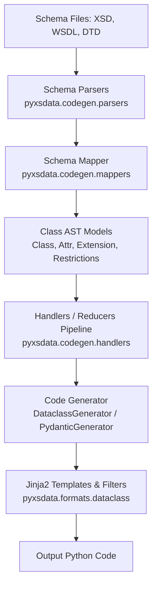

# Pyxsdata Code Generation Architecture & Recipes

This skill guides adding or refactoring code generation features in `pyxsdata`.

## 1. Pipeline Architecture Overview



## 2. Key Component Responsibilities

1. **AST Models (`pyxsdata/codegen/models.py`)**:
   - `Class`: Represents a complexType, element, simpleType, or union.
   - `Attr`: Represents an element, attribute, text content, or wildcard field.
   - `Extension`: Represents inheritance, base types, or restrictions.
   - `Restrictions`: Contains min/max occurs, lengths, patterns, and constraints.

2. **Code Filters (`pyxsdata/formats/dataclass/filters.py`)**:
   - Provides Jinja2 template helpers: `class_name`, `field_name`, `type_name`,
     `class_bases`, `class_meta_bases`, `class_annotations`.
   - Manages import resolution patterns and cross-referencing between generated classes.
   - Maintains `__slots__` for minimal memory overhead. Any new attributes must be
     declared in `__slots__`.

3. **Jinja2 Templates (`pyxsdata/formats/dataclass/templates/`)**:
   - `class.jinja2`: Renders `@dataclass` or `BaseModel` classes, docstrings, inner
     `Meta` class, and field definitions.
   - `enum.jinja2`: Renders Enum classes.
   - `module.jinja2`: Renders the full Python file, header, imports, and top-level
     definitions.
   - `package.jinja2`: Renders package `__init__.py` and lazy-load module resolution.

4. **Runtime Binding Compatibility (`pyxsdata/formats/dataclass/models/builders.py`)**:
   - `build_class_meta`: Builds XML metadata from `clazz.Meta`. Inspects
     `clazz.__dict__` to prevent parent `Meta` leakage.
   - `build_vars`: Discovers fields and builds `XmlVar` instances. Uses `type_hints` and
     handles properties/computed fields.

## 3. Recipe: Adding a New Code Generator Feature

When adding support for a new schema or typing feature:

1. **Update AST or Filters**:
   - If introducing a new template helper, add it as a method on `Filters` in
     `filters.py`.
   - Register the filter in `Filters.register(env)`.
   - Add all new filter instance attributes to `Filters.__slots__`.

2. **Update Jinja2 Templates**:
   - Edit the relevant template in `templates/` (e.g. `class.jinja2`).
   - Keep templates clean: compute complex logic in `Filters` and pass clean
     booleans/lists to the template.

3. **Preserve Runtime Binding Independence**:
   - In `builders.py`, always ensure `clazz.__dict__.get("Meta")` or `meta.__dict__` is
     used when extracting local class overrides so inheritance does not leak element
     names or namespaces.

4. **Testing Checklist**:
   - Use `tests.utils.testing` factories:
     ```python
     from tests.utils.testing import ClassFactory, ExtensionFactory, AttrFactory, AttrTypeFactory
     ```
   - For filter unit tests: add methods to `tests/formats/dataclass/test_filters.py`.
   - For generator integration tests: add test cases in
     `tests/formats/dataclass/test_generator.py` or `tests/pydantic/test_generator.py`.
   - Verify 100% statement and branch coverage:
     ```bash
     PATH="$PWD/.venv/bin:$PATH" .venv/bin/pytest --cov=./pyxsdata --cov-branch --cov-fail-under=100
     ```
